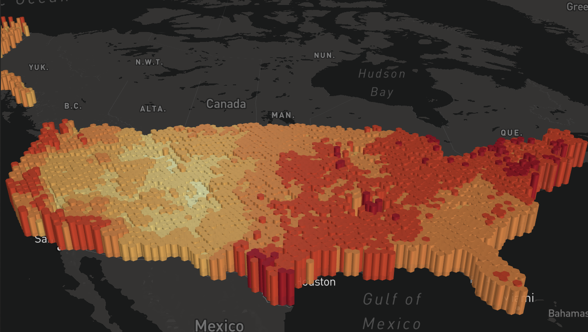

# Wynd DAO Pilars

Wynd DAO is a revolutionary approach to solve the climate problems. It will acheive the [vision](/) via 4 main pilars:

1. Instead of relying upon agencies and carbon credit organizations bringing in months old data for the state of our planet, WYND is using satellite data for bringing in near real time data about gases like – carbon-monoxide, sulphur, etc. This brings more awareness and visibility on the state of any person's surrounding state of environment, and allows us to offer incentives based on _real, measurable impact_. For now, only AIR quality is being targeted but plans to include WATER and Soil (EARTH) current state also is planned & possible. WYND is targeting to build a set of crucial environmental data oracle services and hence enabling other dapps too to build products and services based on the real world data.

**3d-Visualizing Carbon Monoxide Concentrations**

([src](https://emissions-api.org/examples/deck.gl))

2. Current state of human perception on growth is based on what's valued in the market. Yet these values are constantly manipulated by marketing and don't account for "externalities", such as clearcutting forests. Wynd is an attempt to fill the gap by re-attaching true value to the "market" by using Web3 tools and Technologies. The Wynd DAO will design new mechanisms and DeFi primitives to make this connection, inspired by a Hackathon project on environmental futures. This helps in building a market where constructive deeds are rewarded and destructive manipulations are penalized by the market itself.

3. Wynd DAO will use the success of blockchain and web3 tools in terms of transparency, scalability, network effect and global reach for enabling and empowering on-ground communities working on environmental causes to achieve growth and support. Wynd DAO will make active efforts to make the work of these on ground communities to reach not just on-chain but also visually. Wynd DAO will eventually enable transparency over Impact Investments and Philanthropy contributions, thus attracting larger masses and making the funds create its true, verifiable impact.

4. Wynd DAO will also be involved in NFTs and mini-games in order to reach larger masses and especially younger generations because these are the humans who will be handling more responsibility in coming years. Wynd DAO will be utilizing NFTs / Mini-Games / Badges for educating the people with sustainable environment tools, techniques, activities, opportunities under learn-to-earn, contribute-to-earn models.

**Join the Wynd DAO to co-create a new economy where earning money and protecting the environment go hand in hand. Where collaboration and participation, not competition and passivity, are the order of the day.**

([src](https://starecat.com/happy-koala-bear/))

[View Roadmap](./roadmap){: .btn .btn-purple }
